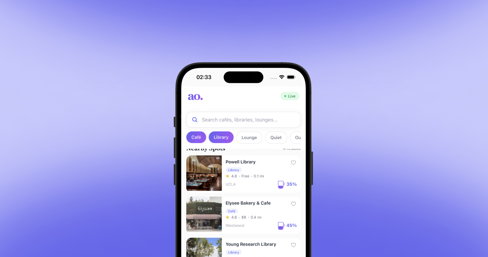

# www.useavailo.com

Get real-time occupancy for cafes, libraries, and study spaces. Availo shows you exactly how crowded a spot is before you go — so you never waste a trip to a packed coffee shop. Launching at UCLA.

## Features

- **Live Occupancy Data** See exactly how busy a spot is, updated in real-time using IoT sensor data.
- **Map View** Find open cafes and libraries near you at a glance with color-coded crowd indicators.
- **Smart Search** Filter by space type — cafés, libraries, lounges - and sort by distance or availability.
- **Favorites & Notifications** Save your go-to spots and get notified when they empty out.
- **Study Space Ratings** WiFi speed, outlet access, noise level, and ambience — all the details that matter.
- **Privacy First Design** Anonymous device counting via WiFi/BLE scanning. No cameras, no tracking.

## Tech Stack

- **Frontend:** React Native, Node.js, Expo
- **Backend:** Firebase Cloud Functions, Firestore
- **IoT:** ESP32-S3, LoRaWAN, The Things Network (TTN)
- **Hardware:** Heltec WiFi LoRa 32 V3, SenseCap M2 Gateway
- **Deployment:** Framer (landing page)
